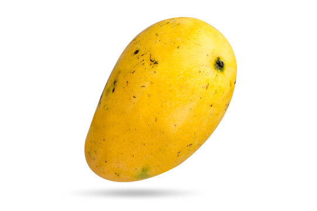

# Healthy-Defective-Fruits

# Dataset Apples Images
The developed data set consists of 5,000 real and synthetic images of fresh apples, and 5,000 real and synthetic images of apples with defects.


# Dataset Mangoes Images
The developed data set consists of 5,000 real and synthetic images of fresh mangoes, and 5,000 real and synthetic images of mangoes with defects.




For paper reference (Bibtex)

```
@conference{visapp23,
  author={Renzo Pacheco. and Paula González. and Luis Chuquimarca. and Boris Vintimilla. and Sergio Velastin.},
  title={Fruit Defect Detection Using CNN Models with Real and Virtual Data},
  booktitle={Proceedings of the 18th International Joint Conference on Computer Vision, Imaging and Computer Graphics Theory and Applications - Volume 4: VISAPP, (VISIGRAPP 2023)},
  year={2023},
  pages={272-279},
  publisher={SciTePress},
  organization={INSTICC},
  doi={10.5220/0011679800003417},
  isbn={978-989-758-634-7},
  issn={2184-4321},
}
```
